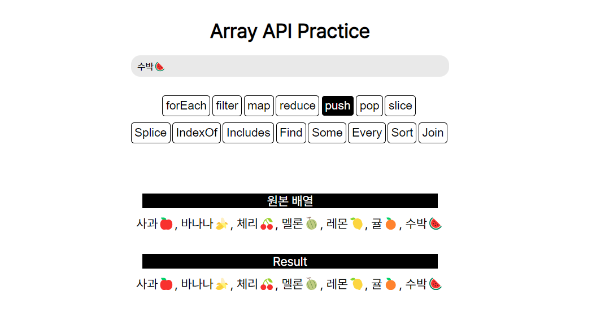

# React-Practice ⚛️

## 1. arrayAPI

🔗 [arrayAPI 공부 내용 정리 블로그 링크](https://mynamesieun.github.io/javascript/%EB%B0%B0%EC%97%B4%EA%B3%BC-%EB%A9%94%EC%84%9C%EB%93%9C/)



<br>

### ✅ 구현 내용

1. `forEach`: Array의 각 아이템을 출력
2. `filter`: Array의 요소 중에서 입력한 값과 일치하는 요소들만 출력
3. `map`: Array의 각 요소를 대문자로 변환하여 출력
4. `reduce`: 각 아이템을 쉼표로 구분하여 출력
5. `push`: input 태그에 입력한 값을 배열 끝에 추가하여 출력
6. `pop`: 배열에서 마지막 아이템을 제거하고 결과를 출력
7. `slice`: 원본 배열의 뒤에서 두 개의 아이템을 제외한 나머지를 출력
8. `splice`: 원본 배열의 2번째 위치부터 2개의 아이템을 제거하고 "pineapple🍍", "grape🍇"을 추가하여 결과를 출력
9. `indexOf`: input에 입력한 값과 일치하는 값이 있는 경우 해당 index를 출력, 없는 경우, -1을 출력
10. `includes`: 원본배열이 input에 입력한 값과 일치하는 정확한 과일명을 가지고있는 경우 true 출력, 그 외의 경우 false 출력
11. `find`: 원본배열이 input에 입력한 값을 포함하는 과일명을 가지고있는 경우 과일명을 출력, 그 외의 경우 "Not Found"를 출력
12. `some`: 원본배열이 input에 입력한 값을 포함하는 과일명을 가지고있는 경우 true을 출력, 그 외의 경우 false 를 출력
13. `every`: 모든 과일명이 5글자를 초과하는 경우 true를 출력, 그 외의 경우 false를 출력
14. `sort`: 알파벳 내림차순 정렬 후 리스트 명을 ", "로 구분하여 출력
15. `join`: 배열의 모든 요소를 쉼표(", ")로 구분하고 결합된 문자열을 출력

<br>

### 🌟 발생한 문제와 알게된 내용

1. `slice()` 메서드는 원본 배열을 변경하지 않고 새로운 배열을 반환한다.

   - 즉, 새 배열을 반환하는 메서드 또는 결과 값을 반환하는 메서드의 경우 `const newArr = [...array];`와 같이 원래 배열을 복사하여 새로운 배열을 만들 필요가 없는 것이다!
   - 이처럼 새로운 배열을 반환하는 메서드는 map, filter, slice, concat 등이 있다.
   - 원본 배열을 수정하는 메서드(push, pop, shift, splice 등)의 경우 원래 배열을 복사해야한다.

   🔽 수정 전 코드

   ```jsx
   const hanlderSlice = () => {
     const newArr = [...array];
     newArr.slice(0, -2);
     setResult(sliced.join(", "));
   };
   ```

   🔽 수정 후 코드

   ```jsx
   const hanlderSlice = () => {
     const newArr = array.slice(0, -2);
     setResult(newArr.join(", "));
   };
   ```

<br>

2. 참조하는 원본 배열 array의 내용도 업데이트되어야한다.

   - newArray는 기존 array를 복사하여 새로운 배열을 만들고, 그 위에 query를 추가한다.
   - 따라서 newArray는 항상 현재 array의 상태를 반영한 새로운 배열이 된다.
   - 즉, 새로운 참조로 상태를 업데이트함으로써 불변성을 지키기 위해 `setArray(newArray)`를 사용하는 것이다.
   - 원본 배열을 수정하는 메서드는 불변성을 지켜야 함에 유의하자!<br><br>

   ```jsx
   const handlePush = () => {
     const newArray = [...array, query];
     setArray(newArray); // 참조하는 원본 array의 값 반영
     setResult(newArray.join(", "));
   };
   ```

<br>

---

<br>
````
